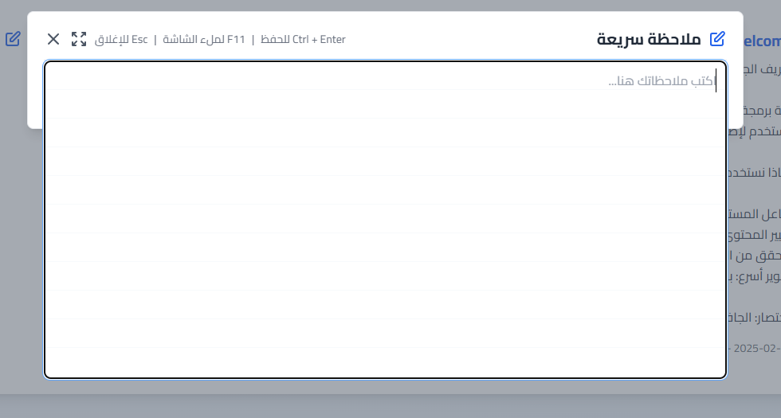
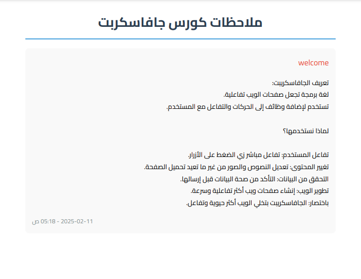

# تطبيق إدارة الملاحظات والمخطط الزمني للكورسات

## مقدمة

هذا التطبيق هو سكربت ويب مبني بلغة PHP مع قاعدة بيانات SQLite، ويهدف إلى تسهيل عملية تسجيل الملاحظات وتنظيم المخطط الزمني للكورسات التي تتعلمها أو تشاهدها، مما يجعله بديلاً عملياً للملاحظات اليدوية. يمكنك من خلال التطبيق إضافة الكورسات وتسجيل الملاحظات المتعلقة بها بالإضافة إلى تنظيم جداول زمنية لمواعيد الدراسة أو المشاهدة، مع إمكانية تصدير كل هذه البيانات إلى ملف PDF.

# المميزات

## الواجهة الرئيسية:


## إدارة الكورسات:


## تسجيل الملاحظات:



## تنظيم المخطط الزمني:


## تصدير البيانات إلى PDF:
- **إمكانية تجميع وتصدير بيانات الملاحظات إلى ملف PDF عبر `export_pdf.php`.**
- **يعتمد ذلك على مكتبة خارجية mpdf يتم تثبيتها باستخدام Composer.**


## قاعدة بيانات SQLite:
- يتم تخزين البيانات في ملف `database.sqlite` مما يبسط عملية الإعداد وعدم الحاجة لتثبيت نظام إدارة قواعد بيانات منفصل.

## إدارة التبعيات باستخدام Composer:
- يحتوي المشروع على ملفي `composer.json` و `composer.lock` لضمان تثبيت كافة المكتبات والتبعيات المطلوبة بسهولة.

# متطلبات التشغيل

- **خادم ويب يدعم PHP:** مثل Apache أو Nginx أو يمكنك استخدام خادم PHP المدمج للتجربة.
- **PHP الإصدار 7.4 أو أحدث**
- **امتداد PDO مع دعم SQLite:** تأكد من تفعيل امتداد PDO و SQLite في إعدادات PHP (`php.ini`).
- **Composer:** لإدارة التبعيات وتثبيت المكتبات الخارجية اللازمة.

# طريقة التثبيت والتشغيل

1. **تنزيل المشروع:**

   قم باستنساخ المشروع من المستودع:
   ```bash
   git clone https://github.com/3bady97/NoteSched.git
   cd NoteSched
   ```
2. **تثبيت مكتبة mPDF باستخدام Composer:**

   تأكد من تثبيت Composer، ثم نفذ الأمر التالي:
   ```bash
   composer require mpdf/mpdf
   ```

   
3. **تشغيل التطبيق:**

   يمكنك تشغيل التطبيق محليًا باستخدام خادم PHP:
 ```bash
  php -S localhost:8000
```

   ثم افتح المتصفح وادخل إلى الرابط التالي:
 ```bash
 http://localhost:8000/index.php
```


#### إذا كنت بحاجة إلى أي تعديل أو مساعدة إضافية، فلا تتردد في طلب ذلك!
## تواصل معي

- [LinkedIn](https://linkedin.com/in/3bady)
- [Facebook](https://facebook.com/king3bady)
